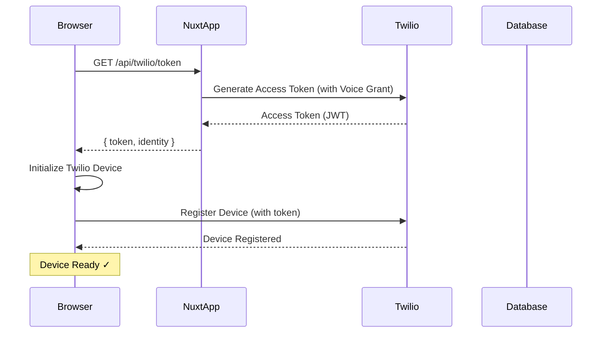
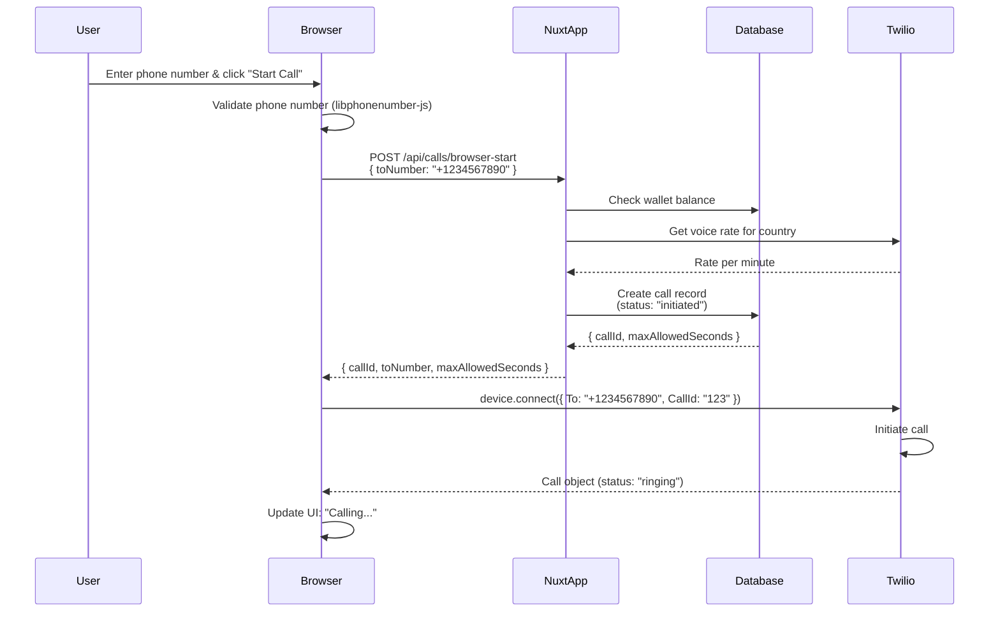
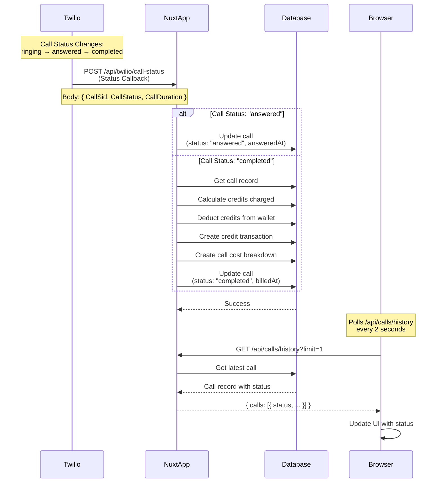
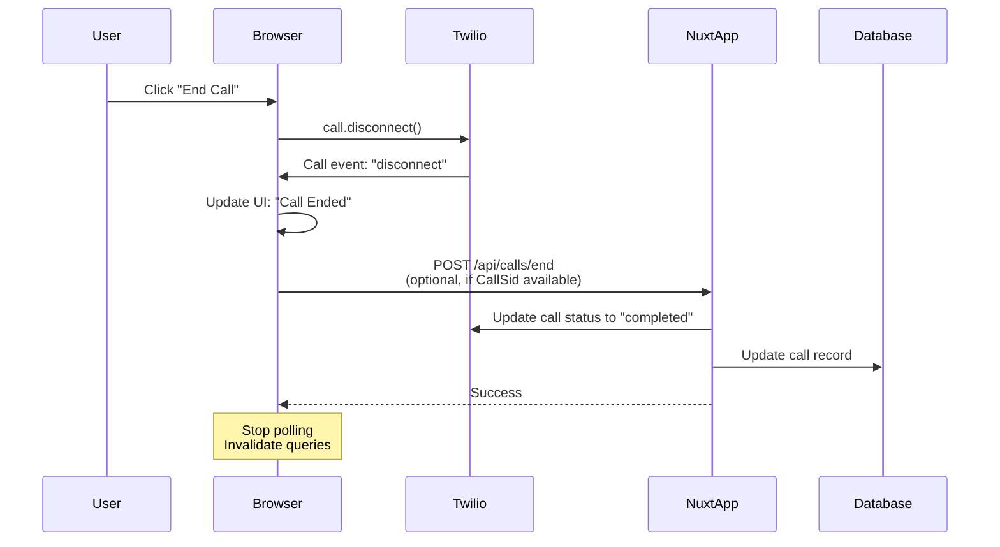

# Browser-Based Calling Flow Diagram

This document explains the complete flow of making phone calls from the browser using Twilio Voice SDK.

## Architecture Overview

```
┌─────────────┐         ┌──────────────┐         ┌─────────────┐
│   Browser   │◄───────►│   Nuxt App   │◄───────►│   Twilio    │
│  (Frontend) │         │   (Backend)  │         │   Services  │
└─────────────┘         └──────────────┘         └─────────────┘
                              │
                              ▼
                       ┌──────────────┐
                       │   Database   │
                       │  (PostgreSQL)│
                       └──────────────┘
```

## Complete Call Flow

### Phase 1: Initialization (Page Load)



### Phase 2: Call Initiation



### Phase 3: Call Connection & TwiML

```mermaid
sequenceDiagram
    participant Browser
    participant Twilio
    participant NuxtApp
    participant Database
    participant Destination

    Twilio->>NuxtApp: POST /api/twilio/voice<br/>(TwiML request)
    Note over Twilio,NuxtApp: Includes: CallSid, To, CallId
    NuxtApp->>Database: Update call record<br/>(twilioCallSid, status: "ringing")
    NuxtApp-->>Twilio: TwiML Response:<br/>&lt;Dial&gt;+1234567890&lt;/Dial&gt;
    Twilio->>Destination: Dial phone number
    Destination-->>Twilio: Ringing/Answering
    Twilio->>Browser: Call event: "accept"
    Browser->>Browser: Update UI: "Answered"
```

### Phase 4: Call Status Updates (Webhooks)



### Phase 5: Call Termination



## Data Flow Diagram

```
┌─────────────────────────────────────────────────────────────────┐
│                         USER BROWSER                            │
│  ┌──────────────────────────────────────────────────────────┐  │
│  │  Dialer Component (Vue)                                   │  │
│  │  - Phone number input                                     │  │
│  │  - Twilio Device (Voice SDK)                              │  │
│  │  - Call status display                                    │  │
│  └──────────────────────────────────────────────────────────┘  │
└─────────────────────────────────────────────────────────────────┘
                            │
                            │ HTTP/HTTPS
                            │
┌─────────────────────────────────────────────────────────────────┐
│                      NUXT APPLICATION                          │
│  ┌──────────────────────────────────────────────────────────┐  │
│  │  API Endpoints                                           │  │
│  │  ├─ GET  /api/twilio/token          (Access Token)      │  │
│  │  ├─ POST /api/calls/browser-start   (Create Call)       │  │
│  │  ├─ POST /api/twilio/voice          (TwiML Response)   │  │
│  │  ├─ POST /api/twilio/call-status    (Status Webhook)    │  │
│  │  └─ POST /api/calls/end             (End Call)          │  │
│  └──────────────────────────────────────────────────────────┘  │
│  ┌──────────────────────────────────────────────────────────┐  │
│  │  Business Logic                                           │  │
│  │  - Balance validation                                     │  │
│  │  - Rate calculation                                       │  │
│  │  - Credit deduction                                       │  │
│  │  - Call record management                                 │  │
│  └──────────────────────────────────────────────────────────┘  │
└─────────────────────────────────────────────────────────────────┘
                            │
                            │ SQL
                            │
┌─────────────────────────────────────────────────────────────────┐
│                        DATABASE                                 │
│  ┌──────────────────────────────────────────────────────────┐  │
│  │  Tables                                                    │  │
│  │  ├─ wallet (balance, credits)                            │  │
│  │  ├─ call (status, twilioCallSid, duration)               │  │
│  │  ├─ credit_transaction (audit trail)                     │  │
│  │  └─ call_cost_breakdown (billing details)                │  │
│  └──────────────────────────────────────────────────────────┘  │
└─────────────────────────────────────────────────────────────────┘
                            │
                            │ REST API
                            │
┌─────────────────────────────────────────────────────────────────┐
│                      TWILIO SERVICES                            │
│  ┌──────────────────────────────────────────────────────────┐  │
│  │  - Voice SDK (WebRTC)                                     │  │
│  │  - TwiML Processing                                       │  │
│  │  - Call Routing                                           │  │
│  │  - Status Callbacks                                       │  │
│  │  - Pricing API                                            │  │
│  └──────────────────────────────────────────────────────────┘  │
└─────────────────────────────────────────────────────────────────┘
                            │
                            │ PSTN
                            │
┌─────────────────────────────────────────────────────────────────┐
│                    DESTINATION PHONE                            │
│                    (e.g., +218XXXXXXXXX)                         │
└─────────────────────────────────────────────────────────────────┘
```

## Key Components

### 1. Browser (Frontend)

- **Twilio Voice SDK**: Handles WebRTC connection
- **Device**: Manages connection to Twilio
- **Call Object**: Represents active call
- **Event Listeners**: Handle call state changes

### 2. Backend (Nuxt)

- **Token Endpoint**: Generates secure access tokens
- **Call Management**: Creates/updates call records
- **Webhook Handlers**: Process Twilio callbacks
- **Billing Logic**: Calculates and deducts credits

### 3. Database

- **Call Records**: Track all call attempts
- **Wallet**: User credit balance
- **Transactions**: Audit trail of credit movements
- **Cost Breakdown**: Detailed billing information

### 4. Twilio Services

- **Voice SDK**: Browser-to-phone connectivity
- **TwiML**: Call instructions (XML)
- **Webhooks**: Real-time status updates
- **Pricing API**: Rate lookups

## State Transitions

```
Call Lifecycle:
┌──────────┐
│ initiated│ ──┐
└──────────┘   │
               │ (Browser connects)
               ▼
┌──────────┐
│ ringing  │ ──┐
└──────────┘   │
               │ (Destination answers)
               ▼
┌──────────┐
│ answered │ ──┐
└──────────┘   │
               │ (Call ends)
               ▼
┌──────────┐
│completed │
└──────────┘

Alternative paths:
- ringing → failed (no answer)
- ringing → busy
- ringing → no-answer
```

## Security Flow

```
1. User Authentication
   └─> Session validation on all endpoints

2. Access Token Generation
   └─> JWT with Voice Grant (expires in 1 hour)
   └─> Identity = User ID

3. Webhook Validation
   └─> HMAC SHA1 signature verification
   └─> X-Twilio-Signature header

4. Balance Checks
   └─> Pre-call validation
   └─> Post-call billing (idempotent)
```

## Error Handling

```
┌─────────────────────────────────────────┐
│  Error Scenarios                        │
├─────────────────────────────────────────┤
│  • Device initialization fails          │
│    └─> Show error message, retry        │
│                                         │
│  • Insufficient credits                 │
│    └─> Block call, show message         │
│                                         │
│  • Call fails to connect                │
│    └─> Update status to "failed"        │
│                                         │
│  • Webhook validation fails             │
│    └─> Reject request (401)             │
│                                         │
│  • Network errors                       │
│    └─> Retry logic, fallback UI        │
└─────────────────────────────────────────┘
```

## Billing Flow

```
1. Pre-Call
   ├─> Check wallet balance
   ├─> Calculate max allowed seconds
   └─> Validate minimum 1 minute

2. During Call
   ├─> Track call duration
   └─> Monitor maxAllowedSeconds

3. Post-Call (on "completed")
   ├─> Calculate credits charged
   ├─> Deduct from wallet
   ├─> Create transaction record
   ├─> Create cost breakdown
   └─> Mark as billed (idempotency)

4. Failed Calls
   └─> No charge (status: failed/busy/no-answer)
```

## Performance Considerations

- **Token Caching**: Tokens valid for 1 hour
- **Polling Interval**: 2 seconds for status updates
- **Webhook Updates**: Real-time (faster than polling)
- **Database Indexes**: On twilioCallSid, userId, status
- **Rate Limiting**: Consider for production

## Testing Checklist

- [ ] Device initializes successfully
- [ ] Access token generation works
- [ ] Call record created in database
- [ ] Browser can connect to Twilio
- [ ] TwiML webhook receives requests
- [ ] Call status updates correctly
- [ ] Credits deducted on completion
- [ ] Failed calls don't charge
- [ ] Call can be ended from browser
- [ ] Webhook signature validation works
